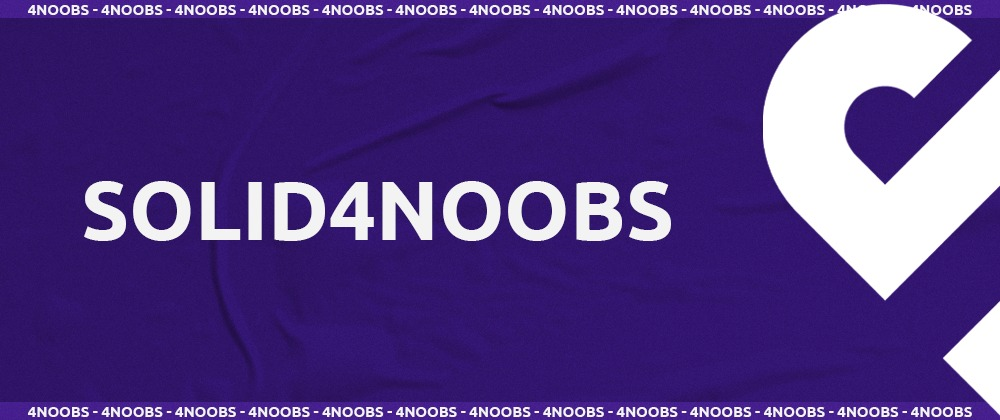

<!-- Logo 4noobs -->

  

<!-- Title -->

  

    
 <!-- ABOUT THE PROJECT -->

## About the Project
SOLID is an acronym for 5 rules that make software development easier and flexible, readable and easy maintanable. 

<!-- ROADMAP OF PROJECT -->

## ROADMAP
- [Introduction](docs/0-introduction.md)
- [Single Responsibility Principle](docs/1-srp.md)
- [Open-Closed Principle](docs/2-ocp.md)
- [Liskov Substitution Principle](docs/3-lsp.md)
- [Interface Segregation Principle](docs/4-isp.md)
- [Dependency Inversion Principle](docs/5-dip.md)

  
<!-- CONTRIBUTING -->

## How to Contribute

Contributions makes that the open source community be a awesome place to learn, inspire and create. All the contributions
are **extremely appreciated**.

1. Fork this project
2. Create a new branch with the chore (`git checkout -b chore/improving-srp`)
3. Make a new commit (`git commit -m 'the most insame commit message'`)
4. Push it into the branch (`git push origin chore/improving-srp`)
5. Open a Pull Request

## Authors

- **Daniel Reis** - Back-end Engineer and He4rt Developers Leader - [@danielhe4rt](https://twitter.com/danielhe4rt)

---

  

