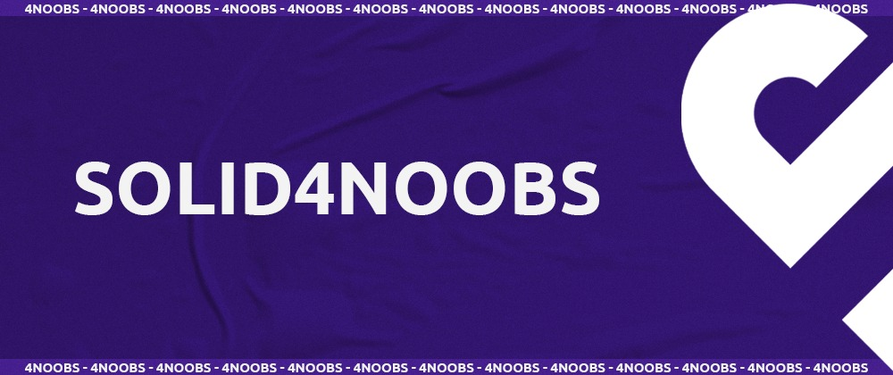

<!-- Logo 4noobs -->

  

<!-- Title -->

  <h2 style="text-align: center">SOLID4Noobs</h2>
  

    
 <!-- ABOUT THE PROJECT -->

## About the Project
SOLID is an acronym for 5 principles that help you build flexible, readable, and maintainable software.

<!-- ROADMAP OF PROJECT -->

## ROADMAP
- [Introduction](docs/0-introduction.md)
- [Single Responsibility Principle](docs/1-srp.md)
- [Open-Closed Principle](docs/2-ocp.md)
- [Liskov Substitution Principle](docs/3-lsp.md)
- [Interface Segregation Principle](docs/4-isp.md)
- [Dependency Inversion Principle](docs/5-dip.md)

  
<!-- CONTRIBUTING -->

## How to Contribute

Contributions make the open source community an amazing place to learn, inspire, and create. Every contribution
is **extremely appreciated**.

1. Fork this project
2. Create a new branch (`git checkout -b chore/improving-srp`)
3. Commit your changes (`git commit -m 'the most insane commit message'`)
4. Push to the branch (`git push origin chore/improving-srp`)
5. Open a Pull Request

## Authors

- **Daniel Reis** - Back-end Engineer and He4rt Developers Leader - [@danielhe4rt](https://twitter.com/danielhe4rt)

---

  

